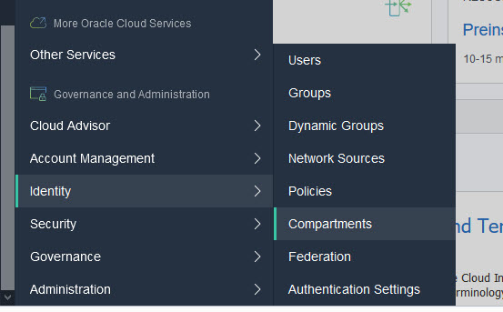

OCI Logging Analytics Workshop for Oracle Internals


Introduction and Scope

the following document describes an introductory workshop to OCI Logging Analytics.

The Workshop is based on the Oracle OCI Analytics Tutorial that you should get from [here](hhttps://docs.oracle.com/en/learn/oci_logging_analytics_tutorial_sample_logs/#introduction) 


Prerequsites

In the beginning of the workshop , your instructor will give you your OCI account, and password.
You should use this information to log into the **oractdemeasec** tenancy  by using the below procedure.

At this stage only LOCAL ACCOUNTS are created to allow you to access the lab environment 

Do not share your credentials with other people , the utilization of the tenancy resources , are monitored, and any abnormal utilization of the tenancy resources will Trigger an invalidation of your local account.


1. Log into the oractdemeasec tenancy


2. Enter your username, and password as in the picture below:

   

   

3. You should change you password ( for the first time login) as in the picture below:

   

4. On the left side of the menu click on the Identity / Compartments
   

   

   5. The Click again on the Workshops hyperlink
   6. 
   7.  the click again on the LogginAnalytics for INTERNALS  hyperlink
      
   
   
   
   8. In this list you will find the associated compartment for your account ( **this is the analytics000 , as your account is analytics000**)


9. Click on the left side of the OCI console to the Logging Analytics  / Administration entry 


10.  Under the Administration hyprelink, choose your compartment ( in your case is analytics000 )  an outlook of the analytics resources will appear :
     BE SURE TO CHOOSE THE **LoggingAnalytics for INTERNALS**  for your configuration there might be other compartments in the tenancy but only the LogginAnalytics for internals is configured for your Labs 


11. In the beginning of the labs you should see 0 entities, 0 Log Groups, 0 Uploads, and 1 saved search.

     


At this stage you should start the workshop by uploading log files to your Logging Analytics Partition.

To start the configuration of your Logging  Analytics Workshop click on the Cloud shell image of the oci console :

 


When the cloud shell is ready you will get this section on the bottom of your screen :


Click on maximize to open a wider terminal


in the cloud shell execute the command:
`git clone https://github.com/eugsim1/logging-analytics-demo-v1.0.git`


A directory is created logging-analytics-demo-v1.0 , then execute the command from your shell :

`cd logging-analytics-demo-v1.0/logging-analytics-demo/`

Execute the following command : ./setup.sh your_workshop_account in our case the command is :

`./setup.sh analytics000`

Be very careful to enter exactly your account as the first argument of the ./setup.sh command.

the setup script is performing a series of initial verifications, then uploads to your account ( in our case analytics000) several logs , creates a log group, and several entities.

Wait until the completion of the script.

`Running demo setup script: Jan-28-2021`
`get the compartment id for the compartment LoggingAnalytics`
`Checking to see if compartment analytics000 under LoggingAnalytics  already exists`
`Compartment  analytics000 Already exists`
`Compartment analytics000 OCID=ocid1.compartment.oc1..aaaaaaaahd45l6jvxsnw5xvnfybs75aqujhmw4ygqjwnawuiay7wo2xjjbba`
`Checking to see if group Logging-Analytics-SuperAdmins already exists`
  `Already exists`
  `Group OCID=ocid1.group.oc1..aaaaaaaaohxgp47nlae5ol67nd3ksdksmw33uzqnd3szmxns5hzvmuf7ntaa`
`Checking to see if policy LoggingAnalytics already exists`
 `Logging Analytics Policy Already exists`
  `Policy OCID=ocid1.policy.oc1..aaaaaaaaxegstfsla4tglsq3wtvycvrqwdkqvjnycojqazbvs5rtvog345vq`
`Checking to see if tenancy already onboarded to Logging Analytics`
  `Namespace=frnj6sfkc1ep`
  `isOnboarded=true`
`compartmentId  ocid1.compartment.oc1..aaaaaaaahd45l6jvxsnw5xvnfybs75aqujhmw4ygqjwnawuiay7wo2xjjbba for  setup_log group => LoggingAnalytics-LogGroup-analytics000`
`Checking to see if log group LoggingAnalytics-LogGroup-analytics000 already exists`
`log group LoggingAnalytics-LogGroup-analytics000 Does not exist yet, create log group`
`Log Group LoggingAnalytics-LogGroup-analytics000 OCID=ocid1.loganalyticsloggroup.oc1.eu-frankfurt-1.amaaaaaaufnzx7iafzno3jejwrgnuwggq6kyxi6zxfdpvxx3tw523auwzo7q`
`from update_timestamps=>Dont Create log directories`
`from update_timestamps=>Dont change Log Record timestamps`
`Compressing files`
```Uploading Logs for user analytics000`
  `Created Entity db1-analytics000 ...`

`Created Entity dbhost1.oracle.com-analytics000 ....`

  ``Created Entity bigip-ltm-dmz1.oracle.com-analytics000` 

  ``Created Entity ...`

  ``Created Entity apigw1.oracle.com-analytics000 ..``


At this stage your Logging Analytics compartment is loaded with data, minimize the cloud shell.
Then refresh the Administration view of the Logging-Analytics

Remember ALWAYS to choose on the Compartment drop-down list your own compartment (analytics000 is our case)
then you should see the following configuration :


On the Administration left entry list click on the entities and you will see that several entities are configured according to annotation entity-user_acount as  (in our case entity-analytics000):


A log group is associated for your account with the annotation LoggingAnalytics-LogGroup-analytics000


Explore the Storage the logs are taking 32 Mb


From this point on you should follow the steps depicted on the tutorial :

https://docs.oracle.com/en/learn/oci_logging_analytics_tutorial_sample_logs/#introduction


On the next version of this Workshop you will install a management Agent on a Linux Host, and you will activate VCN flow logs to a oracle oci bucket, then with the oci cli API you will upload them to Logging Analytics

This tutorial will be regularly updated 

thanks your participating to this learning experience

