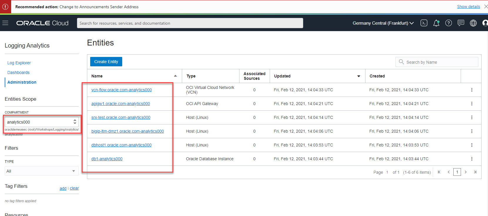
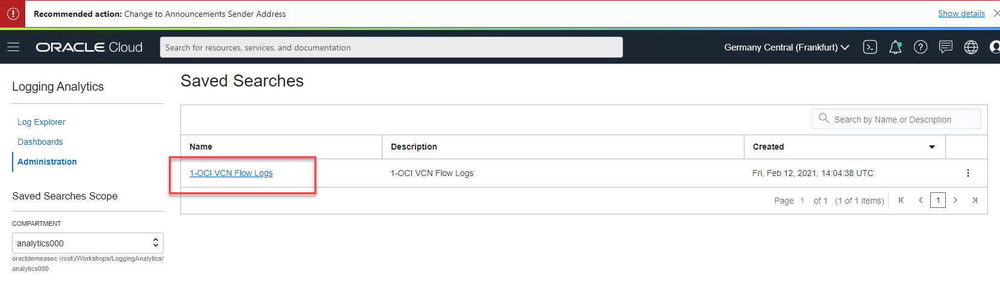

**OCI Logging Analytics Workshop** 


Introduction and Scope

the following document describes an introductory workshop to OCI Logging Analytics.

The Workshop is based on the Oracle OCI Analytics Tutorial that you should get from [here](https://docs.oracle.com/en/learn/oci_logging_analytics_tutorial_sample_logs/#introduction) 


Prerequsites

In the beginning of the workshop , your instructor will give you your OCI account, and password.
You should use this information to log into the **oractdemeasec** tenancy  by using the below procedure.

 

Do not share your credentials with other people , the utilization of the tenancy resources , are monitored, and any abnormal utilization of the tenancy resources will Trigger an invalidation of your local account.


1. Log into the oractdemeasec tenancy

   In a browser enter the keywords oracle cloud console as below, you will get some hyperlinks click on the first one :

   

   

Enter into your browser the url:

```
https://www.oracle.com/cloud/sign-in.html
```


Then you will get this page in your browser enter the name of the tenancy in the textbox as 

```
oractdemeasec
```


Click next to proceed to the login as (check that the url on the browser is login.frankfurt):


2. Enter your username, and password as in the picture below:

   The credentials ( user name and password will be given to you from your instructor )

   

   

   

4. Once logged to the tenancy , then navigate on the left side of the menu click on the Identity / Compartments
   

   

5. Then Click again on the Workshops hyperlink
    
    
6.  Then click again on the LogginAnalytics compartment link :
    
    
      

   

7. In this list you will find the associated compartment for your account ( **this is the analytics000 , as your account is analytics000**)

   Your environment has been preloaded with data you dont need to execute any other scripts.


8. Click on the left side of the OCI console to the Logging Analytics  / Administration entry 


9.  Under the Administration hyperlink,, choose your compartment ( in your case is analytics000 )  an outlook of the analytics resources will appear :


In the beginning of the labs you should see 6 entities, 1 Log Groups, 1 Uploads, and 1 saved search.

In the picture below the number of upload are referred to the total number of upload of other users in the Logging Analytics compartment.


Check you configuration, by clicking on the Administration left entry, always on your account checkbox.
You will see  several entities are configured according to annotation convention  **entity-user_accoun**t as  (in our case entity-analytics000):

 




Click again on the Administration Tab then on the Log Group hyper link:


A log group is associated for your account with the annotation LoggingAnalytics-LogGroup-analytics000


Then on the left side, on the Logging analytics drop down list click again on the Administration entry to go back to Administration menu , then click on the storage:


Explore the Storage the logs are taking 32 Mb


Then click back on the Logging Analytics drop down list ( on the top Left of the browser, and go back to the Administration menu of the Logging analytics)

Explore the uploads by clicking on the Uploads link


You will see the uploaded logs with which you have to run your workshop


On the Administration left entry list click on the entities and you will see that several entities are configured according to annotation entity-user_account as  (in our case entity-analytics000):


Check the log and then number or records by executing your preloaded Search (click on the Logging analytics/ Administration/Saved Searches) :




From this point on you should follow the steps depicted on the tutorial :

https://docs.oracle.com/en/learn/oci_logging_analytics_tutorial_sample_logs/#introduction


On the next version of this Workshop you will install a management Agent on a Linux Host, and you will activate VCN flow logs to a oracle oci bucket, then with the oci cli API you will upload them to Logging Analytics

This tutorial will be regularly updated 

thanks your participating to this learning experience

